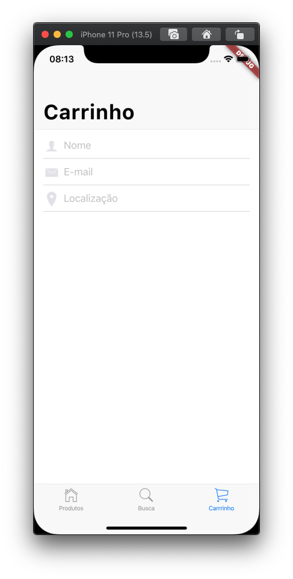

# 8. Adicionar as informações do cliente

Nos próximos três passos, você vai construir a aba do carrinho de compras. Neste primeiro passo, você vai adicionar campos para capturar as informações do cliente.

Atualize o arquivo `carrinho_tab.dart`.

Adicione métodos privados para criar os campos para nome, e-mail e localização. Após, adicione o método `_construirFormulario()` que vai unir os três campos da _interface_ do usuário.

```dart
class _CarrinhoTabState extends State<CarrinhoTab> {
  @override
  Widget build(BuildContext context) {
    return Consumer<ModeloEstadoApp>(
      builder: (context, model, child) {
        return const CustomScrollView(
          slivers: <Widget>[
            CupertinoSliverNavigationBar(
              largeTitle: Text('Carrinho'),
            ),
          ],
        );
      },
    );
  }

  String nome;
  String email;
  String localizacao;
  String pin;
  DateTime dateTime = DateTime.now();

  Widget _construirCampoNome() {
    return CupertinoTextField(
      prefix: const Icon(
        CupertinoIcons.person_solid,
        color: CupertinoColors.lightBackgroundGray,
        size: 28,
      ),
      padding: const EdgeInsets.symmetric(horizontal: 6, vertical: 12),
      clearButtonMode: OverlayVisibilityMode.editing,
      textCapitalization: TextCapitalization.words,
      autocorrect: false,
      decoration: const BoxDecoration(
        border: Border(
          bottom: BorderSide(
            width: 0,
            color: CupertinoColors.inactiveGray,
          ),
        ),
      ),
      placeholder: 'Nome',
      onChanged: (novoNome) {
        setState(() {
          nome = novoNome;
        });
      },
    );
  }

  Widget _construirCampoEmail() {
    return const CupertinoTextField(
      prefix: Icon(
        CupertinoIcons.mail_solid,
        color: CupertinoColors.lightBackgroundGray,
        size: 28,
      ),
      padding: EdgeInsets.symmetric(horizontal: 6, vertical: 12),
      clearButtonMode: OverlayVisibilityMode.editing,
      keyboardType: TextInputType.emailAddress,
      autocorrect: false,
      decoration: BoxDecoration(
        border: Border(
          bottom: BorderSide(
            width: 0,
            color: CupertinoColors.inactiveGray,
          ),
        ),
      ),
      placeholder: 'E-mail',
    );
  }

  Widget _construirCampoLocalizacao() {
    return const CupertinoTextField(
      prefix: Icon(
        CupertinoIcons.location_solid,
        color: CupertinoColors.lightBackgroundGray,
        size: 28,
      ),
      padding: EdgeInsets.symmetric(horizontal: 6, vertical: 12),
      clearButtonMode: OverlayVisibilityMode.editing,
      textCapitalization: TextCapitalization.words,
      decoration: BoxDecoration(
        border: Border(
          bottom: BorderSide(
            width: 0,
            color: CupertinoColors.inactiveGray,
          ),
        ),
      ),
      placeholder: 'Localização',
    );
  }

  SliverChildBuilderDelegate _construirFormulario(ModeloEstadoApp modelo) {
    return SliverChildBuilderDelegate((context, index) {
      switch (index) {
        case 0:
          return Padding(
            padding: const EdgeInsets.symmetric(horizontal: 16),
            child: _construirCampoNome(),
          );
        case 1:
          return Padding(
            padding: const EdgeInsets.symmetric(horizontal: 16),
            child: _construirCampoEmail(),
          );
        case 2:
          return Padding(
            padding: const EdgeInsets.symmetric(horizontal: 16),
            child: _construirCampoLocalizacao(),
          );
        default:
        // Do nothing. For now.
      }
      return null;
    });
  }
}
```

#### Observações:

* Uma das principais maneiras pelas quais o Flutter se diferencia dos ambientes de design da _interface_ de usuário mais tradicionais é que você tem todo o poder de uma linguagem de programação adequada para introduzir abstrações. Você pode adicionar funções à funcionalidade do grupo ou transformá-lo em um _widget_ independente, se desejar reutilizar com facilidade. Como programador, a escolha de como organizar a funcionalidade é sua.

Atualize o método `build()` da classe `_CarrinhoTabState`.

Adicione um `SliverSafeArea` que chama o método `_construirFormulario()`:

```dart
@override
Widget build(BuildContext context) {
  return Consumer<ModeloEstadoApp>(
    builder: (context, model, child) {
      return CustomScrollView(
        slivers: <Widget>[
          const CupertinoSliverNavigationBar(
            largeTitle: Text('Carrinho'),
          ),
          SliverSafeArea(
            top: false,
            minimum: const EdgeInsets.only(top: 4),
            sliver: SliverList(
              delegate: _construirFormulario(model),
            ),
          )
        ],
      );
    },
  );
}
```

#### Observações:

* Com tudo da _interface_ do usuário sendo definida em funções construtoras, o método `build` pode ficar bem pequeno.

Rode o aplicativo. Selecione a aba **Carrinho**. Você deve ver três campos de texto para obter as informações do cliente:



#### Problemas?

Se o seu aplicativo não estiver rodando corretamente, utilize o código dos links a seguir, para voltar aos trilhos.‌

* [lib/carrinho\_tab.dart](https://github.com/ivanwhm/flutter_codelabs_lab5/blob/a6081f3a61b7da6451779cde8a251e50f094808f/lib/carrinho_tab.dart)

