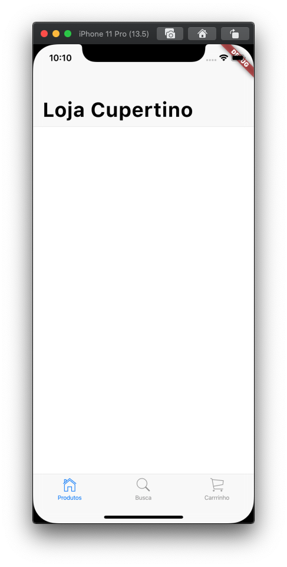

# 5. Adicionar gerenciamento de estado

O aplicativo tem alguns dados em comum que precisam ser compartilhados por múltiplas telas, desta forma precisamos de alguma forma de fluir os dados para cada um dos objetos que necessitam dele. O pacote [`provider`](https://pub.dev/packages/provider) provê uma forma simples para fazer isto. No `provider`, você define um modelo de dados e então usa a classe `ChangeNotifierProvider` para prover o modelo de dados em toda a área de _widgets_.

Crie as classes de modelo de dados.

Crie uma classe de modelo no diretório `lib`. Adicione o arquivo `lib/modelo/produto.dart` que define os dados de produto que veem da fonte de dados:

```dart
import 'package:flutter/foundation.dart';

enum Categoria {
  todos,
  acessorios,
  roupas,
  casa,
}

class Produto {
  const Produto({
    @required this.categoria,
    @required this.codigo,
    @required this.destaque,
    @required this.nome,
    @required this.preco,
  })  : assert(categoria != null),
        assert(codigo != null),
        assert(destaque != null),
        assert(nome != null),
        assert(preco != null);

  final Categoria categoria;
  final int codigo;
  final bool destaque;
  final String nome;
  final int preco;

  String get assetName => '$codigo-0.jpg';
  String get assetPackage => 'shrine_images';

  @override
  String toString() => '$nome (id=$codigo)';
}
```

#### Observações:

* Cada instância de classe `Produto` descreve um produto a venda.

A classe `ProdutoRepositorio` contém a lista completa de produtos a venda com seus preços, nomes e uma categoria. Nosso aplicativo não fará nada com a propriedade `destaque`. A classe também inclui um método chamado `carregaProdutos()` que retorna todos os produtos ou todos os produtos de uma determinada categoria.

Crie o repositório de produtos

Crie o arquivo `lib/modelo/produto_repositorio.dart`. Este arquivo contém todos os produtos a venda. Cada produto pertence a uma categoria.

```dart
import 'produto.dart';

class ProdutoRepositorio {
  static const _todosOsProdutos = <Produto>[
    Produto(
      categoria: Categoria.acessorios,
      codigo: 0,
      destaque: true,
      nome: 'Vagabond sack',
      preco: 120,
    ),
    Produto(
      categoria: Categoria.acessorios,
      codigo: 1,
      destaque: true,
      nome: 'Stella sunglasses',
      preco: 58,
    ),
    Produto(
      categoria: Categoria.acessorios,
      codigo: 2,
      destaque: false,
      nome: 'Whitney belt',
      preco: 35,
    ),
    Produto(
      categoria: Categoria.acessorios,
      codigo: 3,
      destaque: true,
      nome: 'Garden strand',
      preco: 98,
    ),
    Produto(
      categoria: Categoria.acessorios,
      codigo: 4,
      destaque: false,
      nome: 'Strut earrings',
      preco: 34,
    ),
    Produto(
      categoria: Categoria.acessorios,
      codigo: 5,
      destaque: false,
      nome: 'Varsity socks',
      preco: 12,
    ),
    Produto(
      categoria: Categoria.acessorios,
      codigo: 6,
      destaque: false,
      nome: 'Weave keyring',
      preco: 16,
    ),
    Produto(
      categoria: Categoria.acessorios,
      codigo: 7,
      destaque: true,
      nome: 'Gatsby hat',
      preco: 40,
    ),
    Produto(
      categoria: Categoria.acessorios,
      codigo: 8,
      destaque: true,
      nome: 'Shrug bag',
      preco: 198,
    ),
    Produto(
      categoria: Categoria.casa,
      codigo: 9,
      destaque: true,
      nome: 'Gilt desk trio',
      preco: 58,
    ),
    Produto(
      categoria: Categoria.casa,
      codigo: 10,
      destaque: false,
      nome: 'Copper wire rack',
      preco: 18,
    ),
    Produto(
      categoria: Categoria.casa,
      codigo: 11,
      destaque: false,
      nome: 'Soothe ceramic set',
      preco: 28,
    ),
    Produto(
      categoria: Categoria.casa,
      codigo: 12,
      destaque: false,
      nome: 'Hurrahs tea set',
      preco: 34,
    ),
    Produto(
      categoria: Categoria.casa,
      codigo: 13,
      destaque: true,
      nome: 'Blue stone mug',
      preco: 18,
    ),
    Produto(
      categoria: Categoria.casa,
      codigo: 14,
      destaque: true,
      nome: 'Rainwater tray',
      preco: 27,
    ),
    Produto(
      categoria: Categoria.casa,
      codigo: 15,
      destaque: true,
      nome: 'Chambray napkins',
      preco: 16,
    ),
    Produto(
      categoria: Categoria.casa,
      codigo: 16,
      destaque: true,
      nome: 'Succulent planters',
      preco: 16,
    ),
    Produto(
      categoria: Categoria.casa,
      codigo: 17,
      destaque: false,
      nome: 'Quartet table',
      preco: 175,
    ),
    Produto(
      categoria: Categoria.casa,
      codigo: 18,
      destaque: true,
      nome: 'Kitchen quattro',
      preco: 129,
    ),
    Produto(
      categoria: Categoria.roupas,
      codigo: 19,
      destaque: false,
      nome: 'Clay sweater',
      preco: 48,
    ),
    Produto(
      categoria: Categoria.roupas,
      codigo: 20,
      destaque: false,
      nome: 'Sea tunic',
      preco: 45,
    ),
    Produto(
      categoria: Categoria.roupas,
      codigo: 21,
      destaque: false,
      nome: 'Plaster tunic',
      preco: 38,
    ),
    Produto(
      categoria: Categoria.roupas,
      codigo: 22,
      destaque: false,
      nome: 'White pinstripe shirt',
      preco: 70,
    ),
    Produto(
      categoria: Categoria.roupas,
      codigo: 23,
      destaque: false,
      nome: 'Chambray shirt',
      preco: 70,
    ),
    Produto(
      categoria: Categoria.roupas,
      codigo: 24,
      destaque: true,
      nome: 'Seabreeze sweater',
      preco: 60,
    ),
    Produto(
      categoria: Categoria.roupas,
      codigo: 25,
      destaque: false,
      nome: 'Gentry jacket',
      preco: 178,
    ),
    Produto(
      categoria: Categoria.roupas,
      codigo: 26,
      destaque: false,
      nome: 'Navy trousers',
      preco: 74,
    ),
    Produto(
      categoria: Categoria.roupas,
      codigo: 27,
      destaque: true,
      nome: 'Walter henley (white)',
      preco: 38,
    ),
    Produto(
      categoria: Categoria.roupas,
      codigo: 28,
      destaque: true,
      nome: 'Surf and perf shirt',
      preco: 48,
    ),
    Produto(
      categoria: Categoria.roupas,
      codigo: 29,
      destaque: true,
      nome: 'Ginger scarf',
      preco: 98,
    ),
    Produto(
      categoria: Categoria.roupas,
      codigo: 30,
      destaque: true,
      nome: 'Ramona crossover',
      preco: 68,
    ),
    Produto(
      categoria: Categoria.roupas,
      codigo: 31,
      destaque: false,
      nome: 'Chambray shirt',
      preco: 38,
    ),
    Produto(
      categoria: Categoria.roupas,
      codigo: 32,
      destaque: false,
      nome: 'Classic white collar',
      preco: 58,
    ),
    Produto(
      categoria: Categoria.roupas,
      codigo: 33,
      destaque: true,
      nome: 'Cerise scallop tee',
      preco: 42,
    ),
    Produto(
      categoria: Categoria.roupas,
      codigo: 34,
      destaque: false,
      nome: 'Shoulder rolls tee',
      preco: 27,
    ),
    Produto(
      categoria: Categoria.roupas,
      codigo: 35,
      destaque: false,
      nome: 'Grey slouch tank',
      preco: 24,
    ),
    Produto(
      categoria: Categoria.roupas,
      codigo: 36,
      destaque: false,
      nome: 'Sunshirt dress',
      preco: 58,
    ),
    Produto(
      categoria: Categoria.roupas,
      codigo: 37,
      destaque: true,
      nome: 'Fine lines tee',
      preco: 58,
    ),
  ];

  static List<Produto> carregaProdutos(Categoria categoria) {
    if (categoria == Categoria.todos) {
      return _todosOsProdutos;
    } else {
      return _todosOsProdutos.where((p) => p.categoria == categoria).toList();
    }
  }
}
```

#### Observações:

* Neste caso vamos criar uma base de dados falsa de produtos para facilitar o desenvolvimento, mas isto deve ser servido para o aplicativo através de uma API. Uma forma fácil para lidar com a realidade parcialmente desconectada dos celulares é por meio do [`Cloud Firestore`](https://firebase.google.com/docs/firestore/).

Você está pronto para definir a modelo. Crie o arquivo `lib/modelo/modelo_estado_app.dart`. Na classe `ModeloEstadoApp`, forneça os métodos para acessar os dados por meio do modelo. Por exemplo, adicione um método para acessar o total do carrinho de compras, outro para obter a lista de produtos selecionados para compra, outro para obter o custo do envio, e assim por diante.

Crie a classe de modelo.

Aqui está a lista de métodos fornecidos pela classe.

```dart
import 'package:flutter/foundation.dart' as foundation;

import 'produto.dart';
import 'produto_repositorio.dart';

double _percentualImposto = 0.06;
double _custoEntregaPorItem = 7;

class ModeloEstadoApp extends foundation.ChangeNotifier {
  // Todos os produtos disponíveis.
  List<Produto> _produtosDisponiveis;

  // A categoria de produtos selecionada atualmente.
  Categoria _categoriaSelecionada = Categoria.todos;

  // Os códigos e quantidades de produtos no carrinho.
  final _produtosNoCarrinho = <int, int>{};

  Map<int, int> get produtosNoCarrinho {
    return Map.from(_produtosNoCarrinho);
  }

  // O número total de itens no carrinho.
  int get totalProdutosCarrinho {
    return _produtosNoCarrinho.values.fold(0, (acumulador, valor) {
      return acumulador + valor;
    });
  }

  Categoria get categoriaSelecionada {
    return _categoriaSelecionada;
  }

  // Valor total dos produtos no carrinho.
  double get subtotalDeCusto {
    return _produtosNoCarrinho.keys.map((codigo) {
      return obtemProdutoPorCodigo(codigo).preco * _produtosNoCarrinho[codigo];
    }).fold(0, (acumulador, preco) {
      return acumulador + preco;
    });
  }

  // Custo total de entrega.
  double get custoDeEntrega {
    return _custoEntregaPorItem *
        _produtosNoCarrinho.values.fold(0.0, (acumulador, contagem) {
          return acumulador + contagem;
        });
  }

  // Impostos
  double get imposto {
    return subtotalDeCusto * _percentualImposto;
  }

  // Custo total da compra.
  double get totalCost {
    return subtotalDeCusto + custoDeEntrega + imposto;
  }

  // Retorna uma cópia da lista de produtos disponível, filtrada por categoria.
  List<Produto> obtemProdutos() {
    if (_produtosDisponiveis == null) {
      return [];
    }

    if (_categoriaSelecionada == Categoria.todos) {
      return List.from(_produtosDisponiveis);
    } else {
      return _produtosDisponiveis.where((produto) {
        return produto.categoria == _categoriaSelecionada;
      }).toList();
    }
  }

  // Busca produtos no catálogo.
  List<Produto> search(String termosDeBusca) {
    return obtemProdutos().where((product) {
      return product.nome.toLowerCase().contains(termosDeBusca.toLowerCase());
    }).toList();
  }

  // Adiciona um produto no carrinho.
  void adicionaProdutoCarrinho(int codigoProduto) {
    if (!_produtosNoCarrinho.containsKey(codigoProduto)) {
      _produtosNoCarrinho[codigoProduto] = 1;
    } else {
      _produtosNoCarrinho[codigoProduto]++;
    }

    notifyListeners();
  }

  // Remove um produto do carrinho.
  void removeProdutoCarrinho(int codigoProduto) {
    if (_produtosNoCarrinho.containsKey(codigoProduto)) {
      if (_produtosNoCarrinho[codigoProduto] == 1) {
        _produtosNoCarrinho.remove(codigoProduto);
      } else {
        _produtosNoCarrinho[codigoProduto]--;
      }
    }

    notifyListeners();
  }

  // Retorna o produto por meio do código.
  Produto obtemProdutoPorCodigo(int codigo) {
    return _produtosDisponiveis.firstWhere((p) => p.codigo == codigo);
  }

  // Limpa o carrinho.
  void limpaCarrinho() {
    _produtosNoCarrinho.clear();
    notifyListeners();
  }

  // Carrega a lista de produtos do repositório.
  void carregaProdutos() {
    _produtosDisponiveis = ProdutoRepositorio.carregaProdutos(Categoria.todos);
    notifyListeners();
  }

  void selecionaCategoria(Categoria novaCategoria) {
    _categoriaSelecionada = novaCategoria;
    notifyListeners();
  }
}

```

#### Observações:

* Nossa classe de modelo `ModeloEstadoApp` demonstra uma forma de centralizar o estado da nossa aplicação e desta forma, tornar o estado disponível por toda a aplicação. Em passos futuros vamos usar este estado para criar nossas funcionalidades de busca e carrinho de compras.

Atualizar o arquivo `lib/main.dart`.

No método `main()` inicialize o modelo adicionando as linhas marcas com `NOVO`.

```dart
import 'package:flutter/cupertino.dart';
import 'package:provider/provider.dart'; //NOVO

import 'app.dart';
import 'modelo/modelo_estado_app.dart'; //NOVO

void main() {
  return runApp(
    ChangeNotifierProvider<ModeloEstadoApp>(                //NOVO
      create: (_) => ModeloEstadoApp()..carregaProdutos(),  //NOVO
      child: AppLojaCupertino(),                            //NOVO
    ),
  );
}
```

#### Observações:

* Estamos fixando a classe `ModeloEstadoApp` no topo da árvore de _widgets_ para torná-la disponível em todo o aplicativo.
* Estamos usando a classe [`ChangeNotifierProvider`](https://pub.dev/documentation/provider/latest/provider/ChangeNotifierProvider-class.html) do pacote [`provider`](https://pub.dev/packages/provider), que monitora a classe `ModeloEstadoApp` para alterações de notificações.

Rode o aplicativo.

Você deve visualizar a tela em branco a seguir contendo uma barra de navegação do Cupertino, um título e barra de abas contendo três ícones e seus títulos. Você pode alterar entre às três abas, porém suas páginas estão atualmente em branco.



#### Problemas?

Se o seu aplicativo não estiver rodando corretamente, utilize o código dos links a seguir, para voltar aos trilhos.‌

* [lib/app.dart](https://github.com/ivanwhm/flutter_codelabs_lab5/blob/e10d85b8243b13d37cae9f9a5f972bd44775fff0/lib/app.dart)
* [lib/main.dart](https://github.com/ivanwhm/flutter_codelabs_lab5/blob/e10d85b8243b13d37cae9f9a5f972bd44775fff0/lib/main.dart)
* [lib/busca\_tab.dart](https://github.com/ivanwhm/flutter_codelabs_lab5/blob/e10d85b8243b13d37cae9f9a5f972bd44775fff0/lib/busca_tab.dart)
* [lib\_carrinho\_tab.dart](https://github.com/ivanwhm/flutter_codelabs_lab5/blob/e10d85b8243b13d37cae9f9a5f972bd44775fff0/lib/carrinho_tab.dart)
* [lib/produtos\_tab.dart](https://github.com/ivanwhm/flutter_codelabs_lab5/blob/e10d85b8243b13d37cae9f9a5f972bd44775fff0/lib/produtos_tab.dart)
* [lib/modelo/modelo\_estado\_app.dart](https://github.com/ivanwhm/flutter_codelabs_lab5/blob/e10d85b8243b13d37cae9f9a5f972bd44775fff0/lib/modelo/modelo_estado_app.dart)
* [lib/modelo/produto.dart](https://github.com/ivanwhm/flutter_codelabs_lab5/blob/e10d85b8243b13d37cae9f9a5f972bd44775fff0/lib/modelo/produto.dart)
* [lib/modelo/produto\_repositorio.dart](https://github.com/ivanwhm/flutter_codelabs_lab5/blob/e10d85b8243b13d37cae9f9a5f972bd44775fff0/lib/modelo/produto_repositorio.dart)

