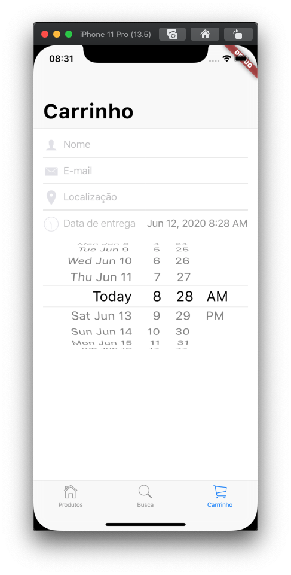

# 9. Adicionar o seletor de data

Neste passo, adicione um `CupertinoDatePicker` ao carrinho para que o usuário possa selecionar a data de entrega de sua preferência.

Adicione os imports e a constante no arquivo `lib/carrinho_tab.dart`.

```dart
import 'package:flutter/cupertino.dart';
import 'package:intl/intl.dart';           //NOVO
import 'package:provider/provider.dart';

import 'modelo/modelo_estado_app.dart';
import 'styles.dart';                      //NOVO

const double kAlturaSeletorData = 216;     //NOVO
```

Adicione a função `_construirSeletorData()` ao _widget_ `_CarrinhoTabState`.

Adicione a função da forma confirme a seguir:

```dart
Widget _construirSeletorData(BuildContext context) {
  return Column(
    children: <Widget>[
      Row(
        mainAxisAlignment: MainAxisAlignment.spaceBetween,
        children: <Widget>[
          Row(
            mainAxisAlignment: MainAxisAlignment.start,
            children: const <Widget>[
              Icon(
                CupertinoIcons.clock,
                color: CupertinoColors.lightBackgroundGray,
                size: 28,
              ),
              SizedBox(width: 6),
              Text(
                'Data de entrega',
                style: Styles.textoTempoEntrega,
              ),
            ],
          ),
          Text(
            DateFormat.yMMMd().add_jm().format(dateTime),
            style: Styles.tempoEntrega,
          ),
        ],
      ),
      Container(
        height: _kAlturaSeletorData,
        child: CupertinoDatePicker(
          mode: CupertinoDatePickerMode.dateAndTime,
          initialDateTime: dateTime,
          onDateTimeChanged: (novaDataEntrega) {
            setState(() {
              dateTime = novaDataEntrega;
            });
          },
        ),
      ),
    ],
  );
}
```

#### Observações:

* Adicionando um `CupertinoDatePicker` é simples e dá ao usuário do iOS uma forma intuitiva de informar datas e horas.

Adicione a chamada para construir da data e hora da _interface_ do usuário na função `_construirFormulario()`.

Adicione o novo código, conforme abaixo:

```dart
SliverChildBuilderDelegate _construirFormulario(ModeloEstadoApp modelo) {
  return SliverChildBuilderDelegate((context, index) {
    switch (index) {
      case 0:
        return Padding(
          padding: const EdgeInsets.symmetric(horizontal: 16),
          child: _construirCampoNome(),
        );
      case 1:
        return Padding(
          padding: const EdgeInsets.symmetric(horizontal: 16),
          child: _construirCampoEmail(),
        );
      case 2:
        return Padding(
          padding: const EdgeInsets.symmetric(horizontal: 16),
          child: _construirCampoLocalizacao(),
        );
      case 3: //ADICIONE DAQUI
        return Padding(
          padding: const EdgeInsets.fromLTRB(16, 8, 16, 24),
          child: _construirSeletorData(context),
        );    // ATÉ AQUI
      default:
      // Não faz nada, por enquanto.
    }
    return null;
  });
}
```

Rode o aplicativo. Selecione a aba **Carrinho**. Você deve ser um seletor de data no estilo do iOS abaixo dos três campos para obter as informações do cliente:



#### Problemas?

Se o seu aplicativo não estiver rodando corretamente, utilize o código dos links a seguir, para voltar aos trilhos.‌

* [lib/carrinho\_tab.dart](https://github.com/ivanwhm/flutter_codelabs_lab5/blob/8dec4f3cd6a5e0ec8f1d18a70bdef02afd9dd923/lib/carrinho_tab.dart)

