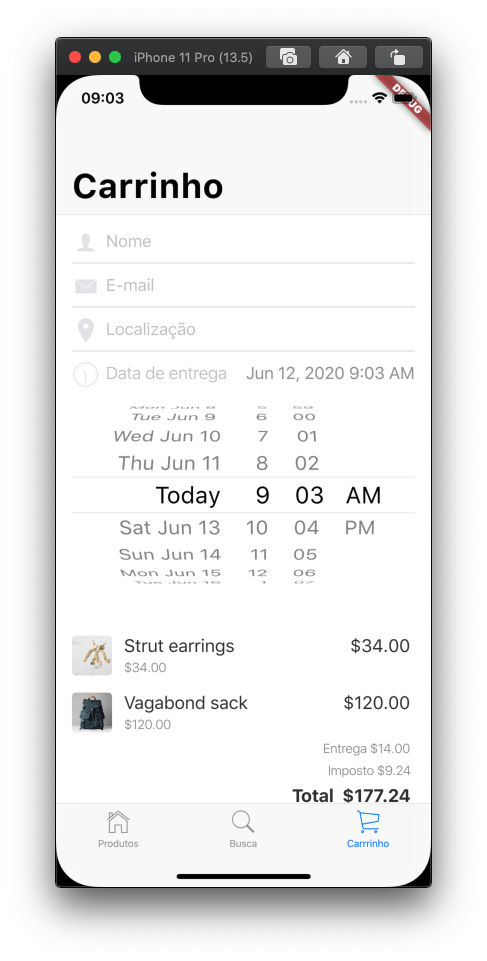

# 10. Adicionar os itens selecionados à compra

Neste passo, adicione os itens selecionados ao carrinho de compra para concluir o aplicativo.

Importe o modelo de produto no arquivo `carrinho_tab.dart`.

```dart
import 'package:flutter/cupertino.dart';
import 'package:intl/intl.dart';
import 'package:provider/provider.dart';

import 'modelo/modelo_estado_app.dart';
import 'modelo/produto.dart';     //NOVO
import 'styles.dart';
```

Adicione o formato da moeda na classe `_CarrinhoTabState`.

Adicione as linhas marcadas com `NOVO`:

```dart
String nome;
String email;
String localizacao;
String pin;
DateTime dateTime = DateTime.now();
final _formatoMoeda = NumberFormat.currency(symbol: '\$'); //NOVO
```

Adicione o índice de produtos na função `_construirFormulario()`.

Adicione as linhas marcadas com `NOVO`:

```dart
SliverChildBuilderDelegate _construirFormulario(ModeloEstadoApp modelo) {
  return SliverChildBuilderDelegate((context, index) {
    final indiceProduto = index - 4; //NOVO
    switch (index) {
    ...
    });
  }
}
```

Na mesma função, exiba os itens da compra:

Adicione o código na seção `default:` da declaração do _switch_, conforme segue:

```dart
SliverChildBuilderDelegate _construirFormulario(ModeloEstadoApp modelo) {
  return SliverChildBuilderDelegate((context, index) {
    final indiceProduto = index - 4;
    switch (index) {
      case 0:
        return Padding(
          padding: const EdgeInsets.symmetric(horizontal: 16),
          child: _construirCampoNome(),
        );
      case 1:
        return Padding(
          padding: const EdgeInsets.symmetric(horizontal: 16),
          child: _construirCampoEmail(),
        );
      case 2:
        return Padding(
          padding: const EdgeInsets.symmetric(horizontal: 16),
          child: _construirCampoLocalizacao(),
        );
      case 3:
        return Padding(
          padding: const EdgeInsets.fromLTRB(16, 8, 16, 24),
          child: _construirSeletorData(context),
        );
      default:
        if (modelo.produtosNoCarrinho.length > indiceProduto) {
          return ItemCarrinho(
            indice: index,
            produto: modelo.obtemProdutoPorCodigo(modelo.produtosNoCarrinho.keys.toList()[indiceProduto]),
            quantidade: modelo.produtosNoCarrinho.values.toList()[indiceProduto],
            ultimoItem: indiceProduto == modelo.produtosNoCarrinho.length - 1,
            formatador: _formatoMoeda,
          );
        } else if (modelo.produtosNoCarrinho.keys.length == indiceProduto && modelo.produtosNoCarrinho.isNotEmpty) {
          return Padding(
            padding: const EdgeInsets.symmetric(horizontal: 20),
            child: Row(
              mainAxisAlignment: MainAxisAlignment.end,
              children: <Widget>[
                Column(
                  crossAxisAlignment: CrossAxisAlignment.end,
                  children: <Widget>[
                    Text(
                      'Entrega '
                      '${_formatoMoeda.format(modelo.custoDeEntrega)}',
                      style: Styles.linhaProdutoPrecoDoItem,
                    ),
                    const SizedBox(height: 6),
                    Text(
                      'Imposto ${_formatoMoeda.format(modelo.imposto)}',
                      style: Styles.linhaProdutoPrecoDoItem,
                    ),
                    const SizedBox(height: 6),
                    Text(
                      'Total  ${_formatoMoeda.format(modelo.totalCost)}',
                      style: Styles.linhaProdutoTotal,
                    ),
                  ],
                )
              ],
            ),
          );
        }
    }
    return null;
  });
}
```

No final do arquivo, adicione a classe `ItemCarrinho`.

```dart
class ItemCarrinho extends StatelessWidget {
  const ItemCarrinho({
    @required this.indice,
    @required this.produto,
    @required this.ultimoItem,
    @required this.quantidade,
    @required this.formatador,
  });

  final Produto produto;
  final int indice;
  final bool ultimoItem;
  final int quantidade;
  final NumberFormat formatador;

  @override
  Widget build(BuildContext context) {
    final row = SafeArea(
      top: false,
      bottom: false,
      child: Padding(
        padding: const EdgeInsets.only(
          left: 16,
          top: 8,
          bottom: 8,
          right: 8,
        ),
        child: Row(
          children: <Widget>[
            ClipRRect(
              borderRadius: BorderRadius.circular(4),
              child: Image.asset(
                produto.assetName,
                package: produto.assetPackage,
                fit: BoxFit.cover,
                width: 40,
                height: 40,
              ),
            ),
            Expanded(
              child: Padding(
                padding: const EdgeInsets.symmetric(horizontal: 12),
                child: Column(
                  mainAxisAlignment: MainAxisAlignment.start,
                  crossAxisAlignment: CrossAxisAlignment.start,
                  children: <Widget>[
                    Row(
                      mainAxisAlignment: MainAxisAlignment.spaceBetween,
                      children: <Widget>[
                        Text(
                          produto.nome,
                          style: Styles.linhaProdutoNomeDoItem,
                        ),
                        Text(
                          '${formatador.format(quantidade * produto.preco)}',
                          style: Styles.linhaProdutoNomeDoItem,
                        ),
                      ],
                    ),
                    const SizedBox(
                      height: 4,
                    ),
                    Text(
                      '${quantidade > 1 ? '$quantidade x ' : ''}'
                      '${formatador.format(produto.preco)}',
                      style: Styles.linhaProdutoPrecoDoItem,
                    )
                  ],
                ),
              ),
            ),
          ],
        ),
      ),
    );

    return row;
  }
}
```

Rode o aplicativo. Na aba de produtos, selecione alguns itens para compra clicando no botão com um sinal de mais. Selecione a aba **Carrinho**. Você deve ver os itens da sua compra, listados abaixo do seletor de data:



#### Problemas?

Se o seu aplicativo não estiver rodando corretamente, utilize o código dos links a seguir, para voltar aos trilhos.‌‌

* [​lib/carrinho\_tab.dart](https://github.com/ivanwhm/flutter_codelabs_lab5/blob/005c15b841959e1193dbfa926592a038794ea679/lib/carrinho_tab.dart)

