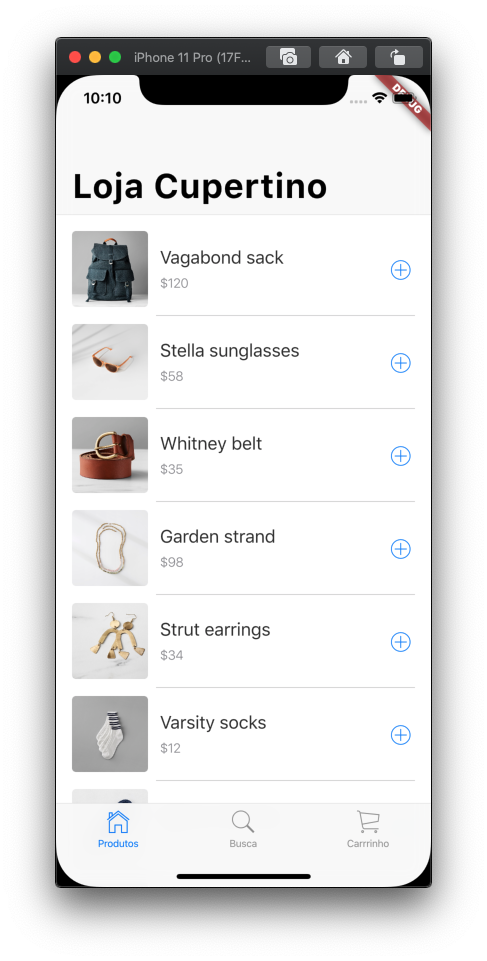

# 6. Listar os produtos à venda

Neste passo, vamos exibir os produtos à venda a aba de produtos.

Adicione o arquivo `lib/linha_item_produto.dart` para exibir os produtos.

Crie o arquivo `lib/linha_item_produto.dart` com o seguinte conteúdo:

```dart
import 'package:flutter/cupertino.dart';
import 'package:provider/provider.dart';

import 'modelo/modelo_estado_app.dart';
import 'modelo/produto.dart';
import 'styles.dart';

class LinhaItemProduto extends StatelessWidget {
  const LinhaItemProduto({
    this.indice,
    this.produto,
    this.ultimoItem,
  });

  final Produto produto;
  final int indice;
  final bool ultimoItem;

  @override
  Widget build(BuildContext context) {
    final row = SafeArea(
      top: false,
      bottom: false,
      minimum: const EdgeInsets.only(
        left: 16,
        top: 8,
        bottom: 8,
        right: 8,
      ),
      child: Row(
        children: <Widget>[
          ClipRRect(
            borderRadius: BorderRadius.circular(4),
            child: Image.asset(
              produto.assetName,
              package: produto.assetPackage,
              fit: BoxFit.cover,
              width: 76,
              height: 76,
            ),
          ),
          Expanded(
            child: Padding(
              padding: const EdgeInsets.symmetric(horizontal: 12),
              child: Column(
                mainAxisAlignment: MainAxisAlignment.start,
                crossAxisAlignment: CrossAxisAlignment.start,
                children: <Widget>[
                  Text(
                    produto.nome,
                    style: Styles.linhaProdutoNomeDoItem,
                  ),
                  const Padding(padding: EdgeInsets.only(top: 8)),
                  Text(
                    '\$${produto.preco}',
                    style: Styles.linhaProdutoPrecoDoItem,
                  )
                ],
              ),
            ),
          ),
          CupertinoButton(
            padding: EdgeInsets.zero,
            onPressed: () {
              final model = Provider.of<ModeloEstadoApp>(context, listen: false);
              model.adicionaProdutoCarrinho(produto.codigo);
            },
            child: const Icon(
              CupertinoIcons.plus_circled,
              semanticLabel: 'Adicionar',
            ),
          ),
        ],
      ),
    );

    if (ultimoItem) {
      return row;
    }

    return Column(
      children: <Widget>[
        row,
        Padding(
          padding: const EdgeInsets.only(
            left: 100,
            right: 16,
          ),
          child: Container(
            height: 1,
            color: Styles.linhaProdutoDivisor,
          ),
        ),
      ],
    );
  }
}

```

#### Observações:

* A classe `CupertinoSliverNavigationBar` é a forma que podemos usar o estilo de título expandido do iOS11 na barra de navegação. Isto é importante para fazer o usuário do iOS se sentir em casa no aplicativo.
* Há muita complexidade no conteúdo deste arquivo, pois emulamos a altamente refinada _interface_ do usuário.

No arquivo `lib/produto_tab.dart` importe o arquivo `linha_item_produto.dart`.

```dart
import 'package:flutter/cupertino.dart';
import 'package:provider/provider.dart';

import 'modelo/modelo_estado_app.dart';
import 'linha_item_produto.dart';        //NOVO
```

No método `build()` da classe `ProdutoTab`, obtenha a lista e a quantidade de produtos. Adicione as linhas indicadas abaixo:

```dart
@override
Widget build(BuildContext context) {
  return Consumer<ModeloEstadoApp>(
    builder: (context, model, child) {
      final produtos = model.obtemProdutos();        //NOVO
      return CustomScrollView(                       //ALTERADA
        semanticChildCount: produtos.length,         //NOVO
        slivers: <Widget>[
          CupertinoSliverNavigationBar(
            largeTitle: Text('Loja Cupertino'),
          ),
        ],
      );
    },
  );
}
```

Ainda no método `build(),` adicione um novo item na lista de _widgets_ `slivers` para exibir a lista de produtos. Adicione as novas linhas como indicado abaixo:

```dart
@override
Widget build(BuildContext context) {
  return Consumer<ModeloEstadoApp>(
    builder: (context, model, child) {
      final produtos = model.obtemProdutos();
      return CustomScrollView(
        semanticChildCount: produtos.length,
        slivers: <Widget>[
          CupertinoSliverNavigationBar(
            largeTitle: Text('Loja Cupertino'),
          ),
          SliverSafeArea(    //INÍCIO DO NOVO CONTEÚDO
            top: false,
            minimum: const EdgeInsets.only(top: 8),
            sliver: SliverList(
              delegate: SliverChildBuilderDelegate((context, index) {
                if (index < produtos.length) {
                  return LinhaItemProduto(
                    indice: index,
                    produto: produtos[index],
                    ultimoItem: index == produtos.length - 1,
                  );
                }
                return null;
              }),
            ),
          ),             //TÉRMINO DO NOVO CONTEÚDO
        ],
      );
    },
  );
}
```

#### Observações:

* O entalhe é de responsabilidade do primeiro `sliver` \(`CupertinoSliverNavigationBar`\).
* O novo `sliver` \(`SliverSafeArea`\) e o primeiro `sliver` \(`CupertinoSliverNavigationBar`\) são irmãos \(e não pai-filho\), desta forma não há como comunicar que o entalhe já foi consumido. Desta forma, o segundo `sliver`, tem a propriedade `top` da classe `SliverSafeArea` definida como false para ignorar o entalhe.
* As propriedades `left` e `right` do `SliverSafeArea` continuam com o valor padrão `true`, caso a tela do telefone seja rotacionada e ainda é responsável pela parte inferior, para que a rolagem possa passar pela barra inicial inferior e evitar obstruções ao rolar até o final.
* Esta lógica não é obrigatória aqui, já que nosso aplicativo é restrito a modo retrato, mas incluindo desta forma, garantimos que podemos reusar o código deste aplicativo em outros aplicativos que necessitem de apresentação horizontal.

Rode o aplicativo. Na aba de produtos, você deve visualizar a lista de produtos, com imagens, preços e um botão com um sinal de mais, que adiciona o produto ao carrinho de compras. A ação deste botão será implementada no passo onde você irá construir o carrinho de compras.



#### Problemas?

Se o seu aplicativo não estiver rodando corretamente, utilize o código dos links a seguir, para voltar aos trilhos.‌

* [lib/linha\_item\_produto.dart](https://github.com/ivanwhm/flutter_codelabs_lab5/blob/5cd2baa504ba1cae633a6a5cc325a0f3bae5e65c/lib/linha_item_produto.dart)
* [lib/produtos\_tab.dart](https://github.com/ivanwhm/flutter_codelabs_lab5/blob/5cd2baa504ba1cae633a6a5cc325a0f3bae5e65c/lib/produtos_tab.dart)

