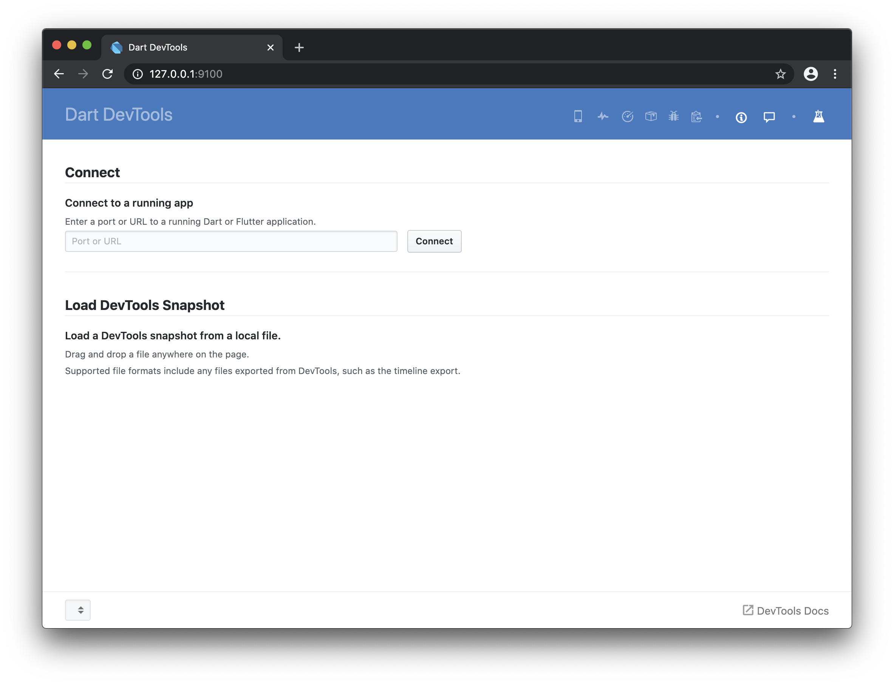
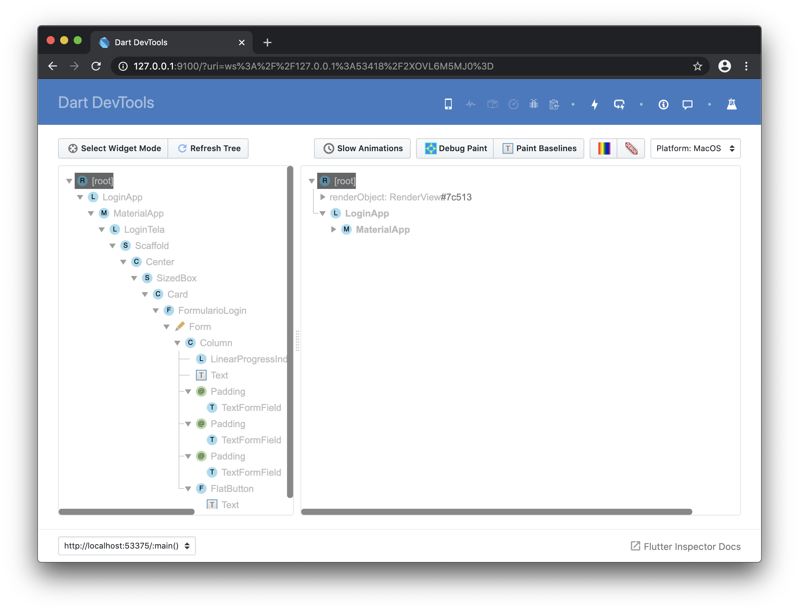
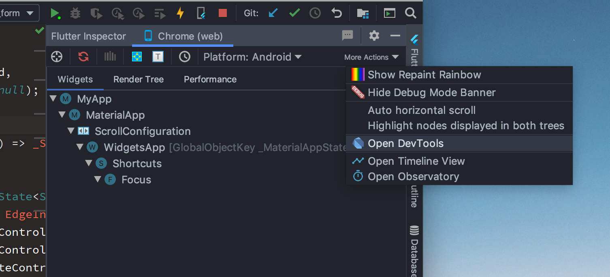
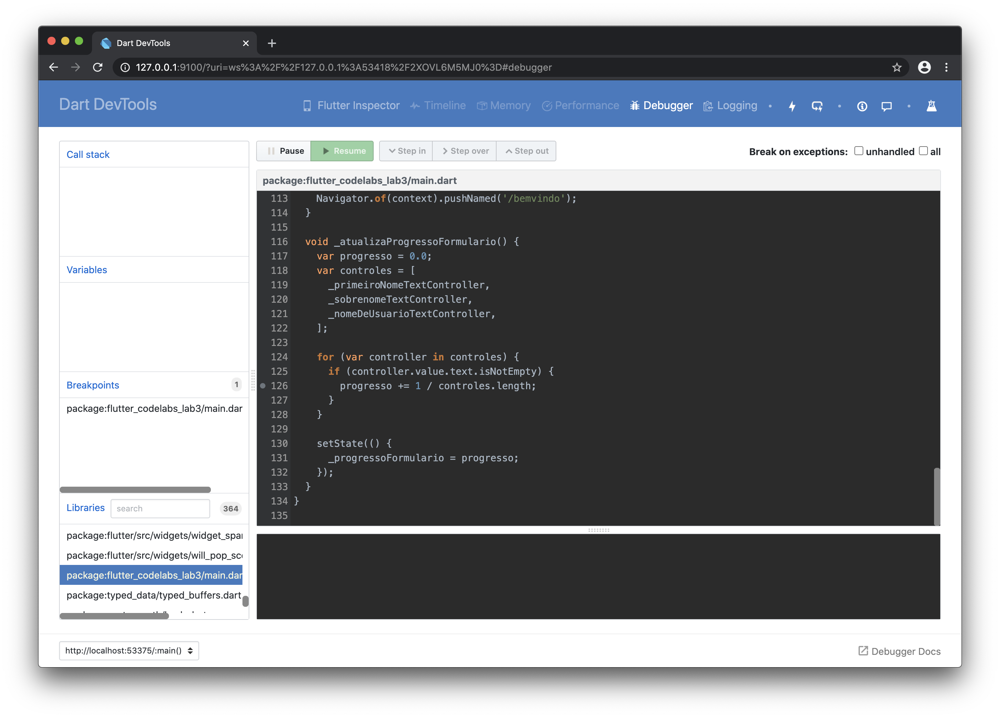

# 4.5. Executar o Dart DevTools

Como depurar uma aplicação web em Flutter? Não é muito diferente de depurar qualquer aplicativo Flutter. Você precisa usar o [Dart DevTools](https://flutter.dev/docs/development/tools/devtools/overview)! \(Não se confunda com Chrome DevTools.\)

Atualmente nosso aplicativo não tem problemas, porém, vamos verificar isto de qualquer forma. As instruções a seguir para executar o DevTools se aplica para qualquer fluxo de trabalho, mas, existe um atalho se você estiver utilizando o IntelliJ. Veja a dica no final desta seção para mais informações.

### 1. Execute o aplicativo

Se você não estiver executando o aplicativo, execute-o agora. Por meio da linha de comando, utilize `flutter run -d chrome` ou selecione o dispositivo **Chrome** da lista de dispositivos da sua IDE e execute-o.

### 2. Obtenha a informação do _web socket_ do DevTools.

Na linha de comando ou na IDE, você deve ver uma mensagem contendo algo parecido com as linhas a seguir:

```bash
Launching lib/main.dart on Chrome in debug mode...
Debug service listening on ws://127.0.0.1:53418/2XOVL6M5MJ0=
```

Copie o endereço do serviço de depuração. Você vai precisar dele para abrir o DevTools.

### 3. Garanta que o DevTools está instalado.

Você tem o [DevTools instalado](https://flutter.dev/docs/development/tools/devtools/overview#how-do-i-install-devtools)? Se você estiver utilizando uma IDE, garanta que você tem as extensões do Flutter e o Dart configuradas, conforme descrito nos artigos para [Visual Studio Code](https://flutter.dev/docs/development/tools/devtools/vscode) e [Android Studio/IntelliJ](https://flutter.dev/docs/development/tools/devtools/android-studio). Se você estiver na linha de comando, execute o servidor DevTools confirme explicado no artigo [Linha de comando do DevTools](https://flutter.dev/docs/development/tools/devtools/cli).

### 4. Conecte no DevTools.

Quando o DevTools inicia, você deve ver algo parecido como a seguir:

```text
Serving DevTools at http://127.0.0.1:9100
```

Digite esta URL no navegador Chrome. Você deve ver a tela de início do DevTools. Ele deve parecer como a seguir:



### 5. Conecte no aplicativo sendo executado.

No campo **Connect to a running site**, cole a localização ws que você copiou no passo 2 e clique no botão **Connect**. Você deve ver o Dart DevTools executando com sucesso no navegador Chrome:



Parabéns, você tem o Dart DevTools executando!

> **Dica**: Esta não é a única forma de executar o DevTools. Se você estiver utilizando o IntelliJ, você pode abrir o DevTools por meio da opção **Flutter Inspector -&gt; More Actions -&gt; Open DevTools**:



### 1. Defina um ponto de parada.

Agora que você tem o DevTools executando, selecione a aba **Debugger** na barra azul ao longo do topo. O painel de depuração aparece e na parte inferior do lado esquerdo você verá a lista de bibliotecas utilizadas neste exemplo. Selecione `package:flutter_codelabs_lab3/main.dart` para exibir o código em Dart no painel central.



### 2. Defina um ponto de parada.

No código Dart, role até onde a variável `progresso` é atualizada:

```dart
for (var controller in controles) {
  if (controller.value.text.isNotEmpty) {
    progresso += 1 / controles.length;
  }
}
```

Coloque um ponto de parada na linha com o laço de repetição, clicando na esquerda do número da linha. A linha de parada agora aparece na seção **Breakpoints** do lado esquerdo da janela.

### 3. Dispare o ponto de parada.

No aplicativo sendo executado, clique em um dos campos de texto para ele ganhar foco. O aplicativo chama o ponto de para e entra em pausa. Na tela do DevTools, você pode ver no painel da esquerda o valor progresso, que é `0`. Isto é esperado, desde que nenhum dos campos foram preenchidos. Passe pelo laço e veja o programa sendo executado.

### 4. Retome o aplicativo.

Retome o aplicativo clicando no botão verde chamado **Resume** na janela do DevTools.

### 5. Exclua o ponto de parada.

Exclua o ponto de parada clicando sobre ele novamente e retome o aplicativo.

Isto lhe dará um pequeno vislumbre do que é possível fazer ao utilizar o DevTools, porém, existe muito mais. Para mais informações veja a [Documentação do DevTools](https://flutter.dev/docs/development/tools/devtools).

