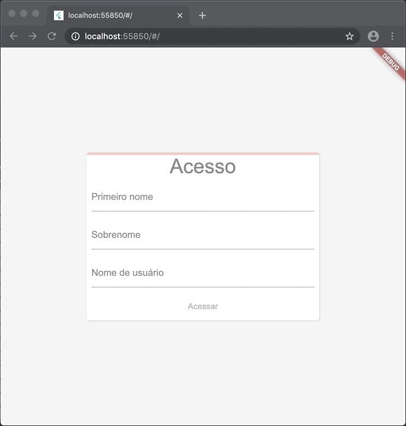

# 1. Introdução

> **Dica**: Este laboratório irá guiar você para escrever seu primeiro aplicativo Flutter para web. Você pode preferir tentar o laboratório [Escrevendo seu primeiro aplicativo móvel Flutter](https://ivanwhm.gitbook.io/laboratorios-de-codigo-do-flutter/escreva-seu-primeiro-aplicativo-flutter-parte-1/introducao). **Caso você tiver baixado e configurado as ferramentas do Android e iOS, o aplicativo completo funciona nos dispositivos Android e iOS!**.

Este é um guia para criar seu primeiro aplicativo Flutter web. Se você está familiarizado com programação orientada a objetos e seus conceitos como variáveis, laços e condicionais, você pode completar este tutorial. Você não precisa de experiência anterior com programação Dart, móvel e web.

### O que você irá construir

Você irá implementar um aplicativo web simples que exibe uma tela de login. A tela contém três campos de texto: primeiro nome, sobrenome e nome de usuário. À medida que o usuário preenche os campos, uma barra de progresso é animada na parte superior da área de login. Quando todos os três campos são preenchidos, a barra de progresso é exibida em verde ao longo de toda a largura da área de login e o botão "Entrar" fica ativado. Clicar no botão "Entrar" faz com que uma tela de boas-vindas seja animada na parte inferior da tela. 

O GIF animado mostra como o aplicativo irá funcionar ao completar este laboratório.

### O que você irá aprender

* Como escrever um aplicativo Flutter que pareça natural na web
* Estrutura básica de um aplicativo Flutter
* Como implementar uma animação Tween
* Como implementar um _widget stateful_
* Como utilizar a depuração e utilizar pontos de parada

### O que você irá usar

Você vai precisar de três _softwares_ para completar este laboratório:

* O [Flutter SDK](https://flutter.dev/docs/get-started/install)
* O [navegador Chrome](https://www.google.com/intl/pt-BR/chrome/)
* Um [editor de texto ou IDE](https://flutter.dev/docs/get-started/editor)

Para um laboratório apenas web, recomendamos o [IntelliJ IDEA ou Visual Studio Code](https://flutter.dev/docs/get-started/editor?tab=vscode). O Android Studio ou o Xcode não são necessários. Você também pode utilizar um editor de texto, se preferir.

Quando estiver desenvolvendo, execute o seu aplicativo web no Chrome então você poderá depurar com o Dart DevTools.

