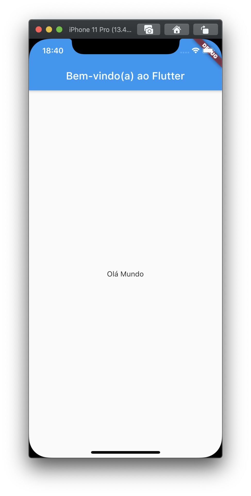
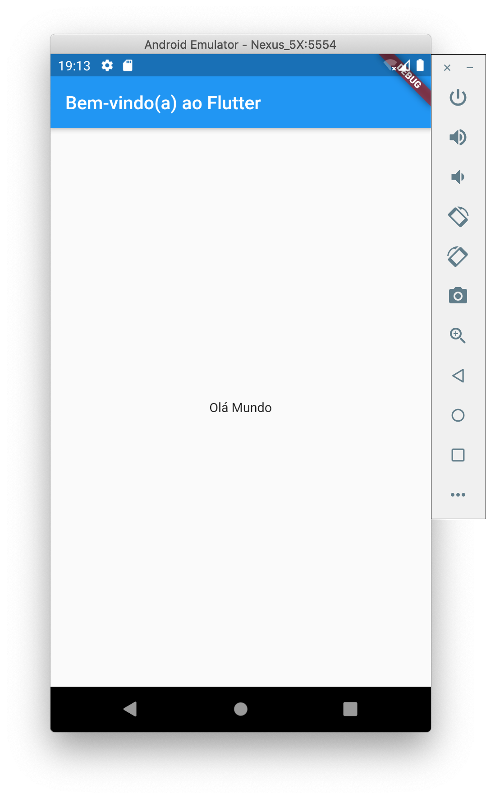

# 3. Criando o aplicativo inicial

▶ Crie um aplicativo simples através do modelo do Flutter usando as instruções da página [Criar um aplicativo](https://flutter.dev/docs/get-started/test-drive?tab=vscode). Informe nome\_empresa \(ao invés de _myapp_\) como nome do projeto. Você irá modificar o aplicativo inicial para criar o aplicativo final.

> **Dica**: Se você não tem a opção de criar um novo projeto Flutter na sua IDE, então verifique e garanta que você tem as [extensões do Flutter e Dart](https://flutter.dev/docs/get-started/editor?tab=vscode) instaladas.

Na maior parte do tempo, você irá editar o arquivo `lib/main.dart` onde está o código Dart.

▶ Substitua o conteúdo do arquivo `lib/main.dart`

Exclua todo o código do arquivo `lib/main.dart` e substitua pelo código abaixo, que irá exibir "Olá Mundo" no meio da tela.

```dart
import 'package:flutter/material.dart';

void main() => runApp(MyApp());

class MyApp extends StatelessWidget {
  @override
  Widget build(BuildContext context) {
    return MaterialApp(
      title: 'Bem-vindo(a) ao Flutter',
      home: Scaffold(
        appBar: AppBar(
          title: const Text('Bem-vindo(a) ao Flutter'),
        ),
        body: Center(
          child: const Text('Olá Mundo'),
        ),
      ),
    );
  }
}
```

> **Dica**: Quando você colar o código no seu aplicativo a identação pode ficar distorcida. Você pode ajustar isto com as seguintes ferramentas do Flutter:
>
> * Android Studio/IntelliJ IDEA: Clique com botão direito no código Dart e selecione a opção **Reformat Code with dartfmt**.
> * Visual Studio Code: Clique bom o botão direito e selecione **Format Document**.
> * Terminal: Execute o comando `flutter format <nome-do-arquivo>`

▶ Execute o aplicativo. Você deve ver a saída do Android ou iOS, dependendo do seu dispositivo.





> **Dica**: Na primeira vez que você executar em um dispositivo físico, pode demorar um tempo para carregar o aplicativo. Após isto, você pode utilizar o _**hot reload**_ para atualizações mais rápidas. Nas IDEs suportadas, ao **Salvar** as alterações, o _**hot reload**_ é acionado se o aplicativo estiver rodando. Quando rodar um aplicativo diretamente do console utilizando o comando `flutter run`, pressione `r` para acionar o _**hot reload**_.

### 👁🗨 Observações

* Este exemplo cria um aplicativo do Material. Material é uma linguagem de design visual que é padrão para dispositivos móveis e para web. O Flutter oferece um conjunto rico de _widgets_ para Material.
* O método `main` usa a notação de seta \(`=>`\). Use a notação de seta em uma função ou método de uma única linha.
* O aplicativo estende a classe`StatelessWidget` que faz com que o aplicativo seja um _widget_. No Flutter quase tudo é um _widget_, incluindo alinhamento, espaçamento e leiaute.
* O _widget_ `Scaffold` da biblioteca do Material, provê uma _app bar ****_padrão, título e a propriedade _body_ que sustenta a árvore de _widgets_ da tela principal. A subárvore do _widget_ pode ser bastante complexa.
* A principal tarefa de um _widget_ é fornecer o método `build` que descreva como exibir o _widget_ assim como outros _widgets_ de nível inferior.
* O corpo \(_body_\) para este exemplo consiste em um _widget_ `Center` que contém um _widget_ filho `Text`. O _widget_ `Center` alinha sua subárvore de _widgets_ no centro da tela.

