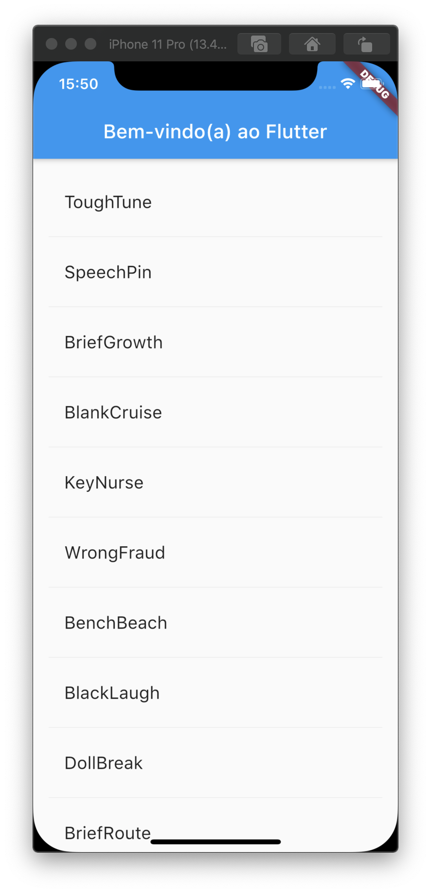

# 6. Criando uma ListView com rolagem infinita

Neste passo você irá expandir a classe `PalavrasRandomicasState` para gerar e exibir uma lista de pares de palavras. Conforme o usuário for rolando a página, a lista \(exibida utilizando o _widget_ `ListView`\) irá crescer infinitamente. O método `builder` que é um construtor utilizando o padrão fábrica da classe `ListView` permite que você faça a inicialização da listagem sob demanda.

▶ Adicione a variável `_sugestoes` __como sendo uma lista na classe `PalavrasRandomicasState` para armazenar as sugestões de pares de palavras. Também adicione a variável `_tamanhoDaFonte` que contém o estilo para deixar o tamanho das fontes maiores.

> **Dica**: Ao prefixar um identificador com o caractere sublinhado \(`_`\) você impõe privacidade na linguagem Dart.

```dart
class PalavrasRandomicasState extends State<PalavrasRandomicas> {
  // Adicione as próximas duas linhas
  final List<WordPair> _sugestoes = <WordPair>[];
  final TextStyle _tamanhoDaFonte = const TextStyle(fontSize: 18); 
  ...
}
```

A seguir, você irá adicionar a função `_construirSugestoes()` na classe `PalavrasRandomicasState`. Este método irá construir a `ListView` para exibir a lista de pares de sugestões de palavras.

A classe `ListView` provê uma propriedade construtora chamada `itemBuilder` que é um construtor utilizando o padrão fábrica e uma função de retorno especificada como uma função anônima. Dois parâmetros são passados para a função - O `BuildContext` e o iterador de linha `i`. O iterador começa a partir do 0 e incrementa cada vez que a função é chamada, ou seja, uma vez para cada par de sugestão de palavras. Este modelo permite que a lista de sugestões cresça infinitamente conforme o usuário for rolando a tela.

▶ Adicione a função `_construirSugestoes()` na classe `PalavrasRandomicasState` \(exclua os comentários, se preferir\):

```dart
Widget _construirSugestoes() {
    return ListView.builder(
      padding: const EdgeInsets.all(16),
      // A função de retorno itemBuild é chamada uma vez para cada
      // par de sugestão de palavras e coloca cada sugestão dentro
      // de uma linha do ListView. Nas linhas pares, a função adiciona
      // uma linha na ListView para o par de palavras. Para as linhas
      // ímpares, a função adiciona um widget chamado Divider para
      // você visualizar um separador entre os pares de palavras.
      // Perceba que o divisor pode ser difícil de ver em
      // dispositivos com telas menores.
      itemBuilder: (BuildContext _context, int i) {
        // Adiciona um dividor de um pixel antes de cada
        // linha da ListView.
        if (i.isOdd) {
          return Divider();
        }

        // A sintaxe "i ~/ 2" efetua a divisão do valor da
        // variável i por 2 e retorna um resultado inteiro.
        // Por exemplo: 1, 2, 3, 4, 5 passam a ser 0, 1, 1, 2, 2.
        // Isto calcula o número corrente de pares de palavras
        // na ListView, menos os widgets divisores.
        final int index = i ~/ 2;
        // Se você já chegou ao fim da lista de pares de
        // palavras disponíveis...
        if (index >= _sugestoes.length) {
          // ... então são gerados mais 10 pares de palavras
          // e adicionados na lista de sugestão.
          _sugestoes.addAll(generateWordPairs().take(10));
        }
        return _construirLinha(_sugestoes[index]);
      },
    );
  }
```

A função `_construirSugestoes`chama a função `_construirLinha` para cada par de palavras. Aquela função exibirá cada novo par de palavras usando um `ListTile`, que irá permitir que possamos ter linhas mais atrativas na [parte 2](https://codelabs.developers.google.com/codelabs/first-flutter-app-pt2/index.html?index=..%2F..index#0).

▶ Adicione a função `_construirLinha` na classe `PalavrasRandomicasState`:

```dart
Widget _construirLinha(WordPair pair) {
    return ListTile(
      title: Text(
        pair.asPascalCase,
        style: _tamanhoDaFonte,
      ),
    );
  }
```

▶ Atualize o método `build` da classe `PalavrasRandomicasState` para utilizar a função `_construirSugestoes` ao invés de chamar a biblioteca de geração de palavras diretamente. \(O _widget_ `Scaffold` implementa o leiaute visual básico do Material Design\).

```dart
  @override
  Widget build(BuildContext context) {
    // final parDePalavras = WordPair.random(); // Exclua estas 
    // return Text(parDePalavras.asPascalCase); // duas linhas

    return Scaffold(                                   // Adicione daqui
      appBar: AppBar(
        title: const Text('Bem-vindo(a) ao Flutter'),
      ),
      body: _construirSugestoes(),
    );                                                // até aqui
  }

```

▶ Reinicie o aplicativo. Você deve ver uma lista de pares de palavras não importa quantas vezes você role a tela.




#### Problemas?

Se o seu aplicativo não estiver rodando corretamente, utilize o código dos links a seguir, para voltar aos trilhos.‌

* [​lib/main.dart](https://github.com/ivanwhm/flutter_codelabs_lab1/commit/5d3f8b43bd8259daf7ffc6d7ccbe3b89a09c97ff)


