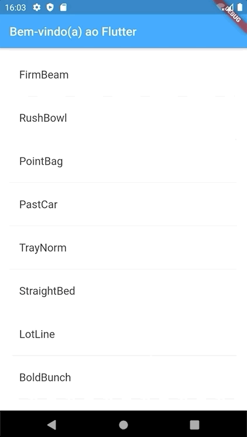

# 1. Introdução

O Flutter é o kit de ferramentas de interface de usuário \(UI\) da Google para construir aplicações lindas e compiladas nativamente, para dispositivos móveis, web e desktop a partir de uma única base de código. O Flutter funciona com código existente, é utilizado por desenvolvedores e organizações ao redor do mundo e é gratuito e tem seu código-fonte aberto.

Neste laboratório, você irá criar um aplicativo móvel simples com Flutter. Se você está familiarizado com código orientado a objetos e conceitos básicos de programação \(como variáveis, laços de repetição e condicionais\), então você poderá completar este laboratório. Você não precisa de experiência prévia com Dart ou programação para dispositivos móveis.

### O que você irá aprender na parte 1

* Como escrever um aplicativo em Flutter que pareça natural no iOS, Android e na Web
* Estrutura básica de um aplicativo Flutter
* Procurar e utilizar pacotes para estender funcionalidades
* Usar o _hot reload_ para um ciclo de desenvolvimento rápido
* Como implementar _stafeful widgets_
* Como criar uma lista infinita e carregada preguiçosamente

Na parte 2 deste laboratório, você irá adicionar interatividade, modificar o tema do aplicativo e adicionar a habilidade de navegar para uma nova página \(chamada de rota no Flutter\)

### O que você irá construir na parte 1

Você irá implementar um aplicativo móvel simples que irá gerar sugestões de nomes para uma empresa iniciante. O usuário pode marcar ou desmarcar nomes, salvando os melhores. O código irá gerar 10 nomes carregados de forma preguiçosa por vez. Conforme o usuário vai rolando, novos lotes de nomes são gerados. O usuário pode rolar infinitamente com nomes sendo gerados de forma contínua.

Os seguintes GIFs animados mostram como o aplicativo irá funcionar quando você completar esta parte:

