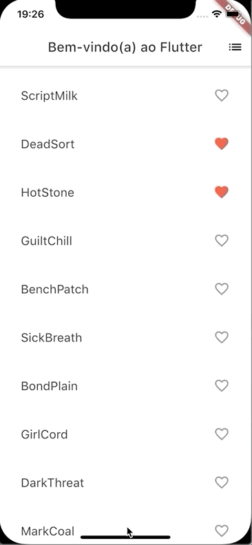
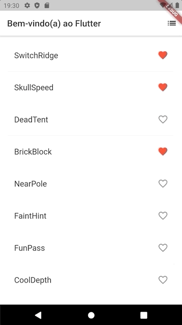

# 7. Próximos passos

### Parabéns!

Você completou a parte 1 deste laboratório de código. 

Você pode obter o código-fonte completo deste laboratório no endereço: [https://github.com/ivanwhm/flutter\_codelabs\_lab1](https://github.com/ivanwhm/flutter_codelabs_lab1).

Se você desejar estender as funcionalidades deste aplicativo, vá para a [parte 2](https://ivanwhm.gitbook.io/laboratorios-de-codigo-do-flutter/escreva-seu-primeiro-aplicativo-flutter-parte-2/introducao), aonde iremos modificá-lo para adicionar os seguintes comportamentos:

* Adicionar interatividade.
* Adicionar a habilidade de navegar para uma nova rota.
* Modificar a cor do tema.

Quando a [parte 2](https://ivanwhm.gitbook.io/laboratorios-de-codigo-do-flutter/escreva-seu-primeiro-aplicativo-flutter-parte-2/introducao) estiver concluída, seu aplicativo vai ficar parecido com o das imagens a seguir:

