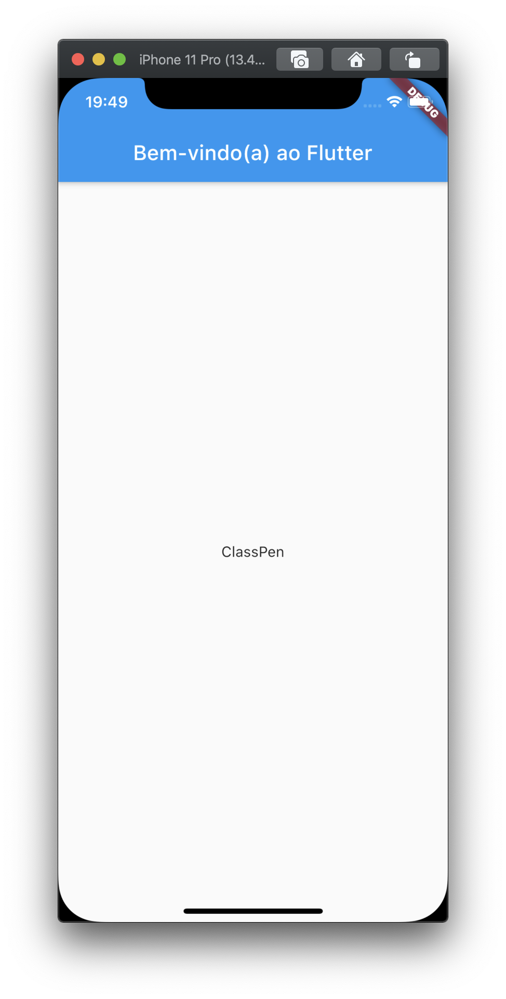
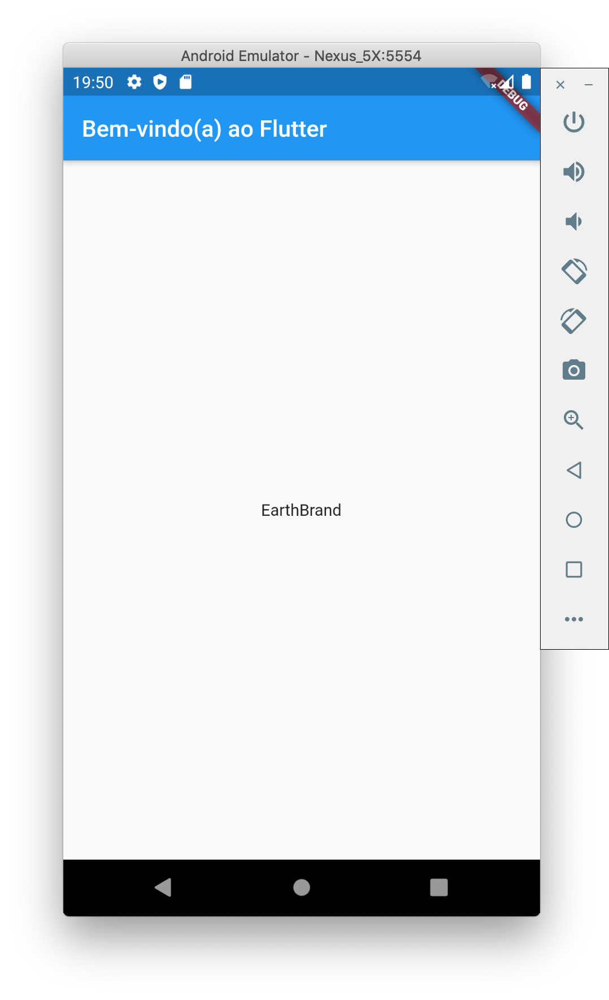

# 4. Use um pacote externo

Neste passo, você irá iniciar o uso de um pacote de código-aberto chamado [**`english_words`**](https://pub.dev/packages/english_words) que contém milhares de palavras mais utilizadas no Inglês, com o adicional de possuir algumas funções.

Você pode encontrar o pacote `english_words`, bem como muitos outros pacotes de código-aberto em [`pub.dev`](https://pub.dev/).

▶ O arquivo pubspec gerencia os ativos de um aplicativo Flutter. Em `pubspec.yaml`, adicione `english_words: ^3.1.0` \(`english_words` 3.1.0 ou superior\) na lista de dependências:

```yaml
dependencies:
  flutter:
    sdk: flutter

  cupertino_icons: ^0.1.3
  english_words: ^3.1.0   # adicione esta linha
```

▶ Ao salvar o arquivo pubspec no Visual Studio Code, o pacote será automaticamente instalado. Isto copia o pacote para dentro do seu projeto. Você pode ver a seguinte saída no console:

```bash
flutter packages get
Running "flutter packages get" in startup_namer...
Process finished with exit code 0
```

▶ No arquivo `lib/main.dart`, importe o novo pacote:

```dart
import 'package:flutter/material.dart';
import 'package:english_words/english_words.dart';  // adicione esta linha
```

Enquanto você digita, o Visual Studio Code irá lhe dar sugestões de bibliotecas para importar. Então ele irá renderizar uma linha cinza para você saber que a biblioteca foi importada, mas não foi utiliza \(até agora\).

Em seguida, você irá usar o pacote `english_words` para gerar um texto ao invés de usar a frase "Olá Mundo".

▶ Faça as seguintes alterações:

```dart
import 'package:flutter/material.dart';
import 'package:english_words/english_words.dart';

void main() => runApp(MyApp());

class MyApp extends StatelessWidget {
  @override
  Widget build(BuildContext context) {
    final parDePalavras = WordPair.random(); // adicione esta linha
    return MaterialApp(
      title: 'Welcome to Flutter',
      home: Scaffold(
        appBar: AppBar(
          title: Text('Welcome to Flutter'),
        ),
        body: Center(
          //child: Text('Olá Mundo'),   // substitua este texto
          child: Text(parDePalavras.asPascalCase),  // por este texto
        ),
      ),
    );
  }
}
```

> **Dica**: Pascal case \(também conhecido como upper camel case\) significa que cada palavra de uma string, incluindo a primeira, começa com uma letra em maiúsculo. Desta forma, `upper came case` se transforma em `UpperCamelCase`.

Se o aplicativo estiver executando, ao salvar as alterações o _hot reload_ irá atualizá-lo. \(A partir da linha de comando, você precisa pressionar a tecla `r` para acionar o _hot reload_\). Sempre que você acionar o _hot reload_ ou salvar o projeto, você deverá ver um par de palavras diferente, escolhidos de forma randômica, pelo aplicativo que está sendo executado. Isto acontece, porque o par de palavras está sendo gerado dentro do método `build`, que executa cada vez que o `MaterialApp` necessita ser renderizado, ou quando a opção **Plataforma** é alterada no Flutter Inspector.





#### Problemas?

Se o seu aplicativo não estiver rodando corretamente, procure por erros de digitação. Se precisar utilize o código dos links a seguir, para voltar aos trilhos.

* [pubspec.yaml](https://github.com/ivanwhm/flutter_codelabs_lab1/commit/21ac4ccf77d63f1cb3b2a8c7526b6ded9d3d2255)
* [lib/main.dart](https://github.com/ivanwhm/flutter_codelabs_lab1/commit/21ac4ccf77d63f1cb3b2a8c7526b6ded9d3d2255)

