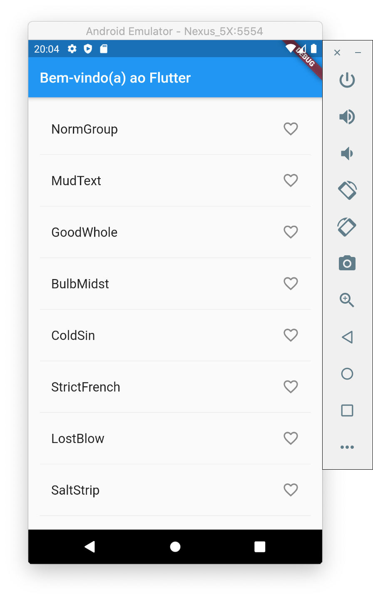

# 4. Adicionar ícones na lista

Neste passo, você vai adicionar um ícone de coração em cada linha. No próximo passo você vai fazer eles terem a possibilidade de serem tocados e salvar o nome na lista de favoritos.

Adicione um conjunto chamado `_salvos` na classe `PalavrasRandomicasState`. Este conjunto irá armazenar o par de palavras favoritadas pelo usuário. Preferimos utilizar um conjunto \(`Set`\) ao invés de uma lista \(`List`\), pois, conjuntos não permitem entradas duplicadas.

```dart
class PalavrasRandomicasState extends State<PalavrasRandomicas> {
  final List<WordPair> _sugestoes = <WordPair>[];
  final Set<WordPair> _salvos = Set<WordPair>(); // adicione esta linha
  final TextStyle _tamanhoDaFonte = const TextStyle(fontSize: 18);
  ...
}
```

Na função `_construirLinha()`, adicione a variável boleana `jaFoiSalva` para garantir que o par de palavras já não foi adicionado nos favoritos.

```dart
Widget _construirLinha(WordPair pair) {
  final bool jaFoiSalva = _salvos.contains(par); // adicione esta linha
  ...
}
```

Na função `_construirLinha()`, você também irá adicionar na lista de objetos `ListTile` um ícone no formato de coração para habilitar  o usuário a favoritar um par de nomes. No próximo passo, você irá adicionar a habilidade de interagir com os ícones de coração.

 Adicione o ícone como exibido abaixo:

```dart
Widget _construirLinha(WordPair par) {
    final bool jaFoiSalva = _salvos.contains(par);
    return ListTile(
      title: Text(
        par.asPascalCase,
        style: _tamanhoDaFonte,
      ),
      trailing: Icon(                                        // adicione daqui
        jaFoiSalva ? Icons.favorite : Icons.favorite_border,
        color: jaFoiSalva ? Colors.red : null,
      ),                                                     // até aqui.
    );
  }
```

Salve o projeto e use o _hot reload_ para recarregar. Você deve ver agora um ícone de coração sem preenchimento em cada linha, porém, eles não são interativos.




#### Problemas?

Se o seu aplicativo não estiver rodando corretamente, utilize o código dos links a seguir, para voltar aos trilhos.‌

* ​[lib/main.dart](https://github.com/ivanwhm/flutter_codelabs_lab2/commit/6551d1c48e4fa7f9b0ba23557be46b8c52cf4adf)

