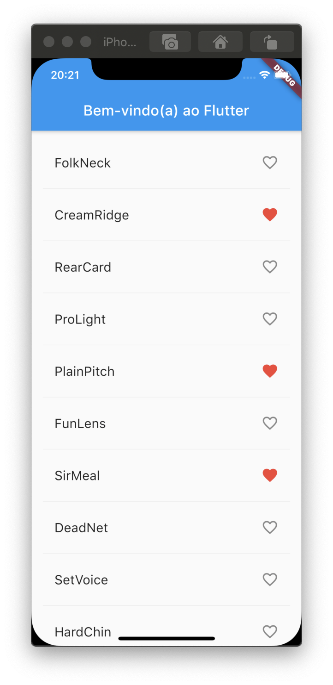
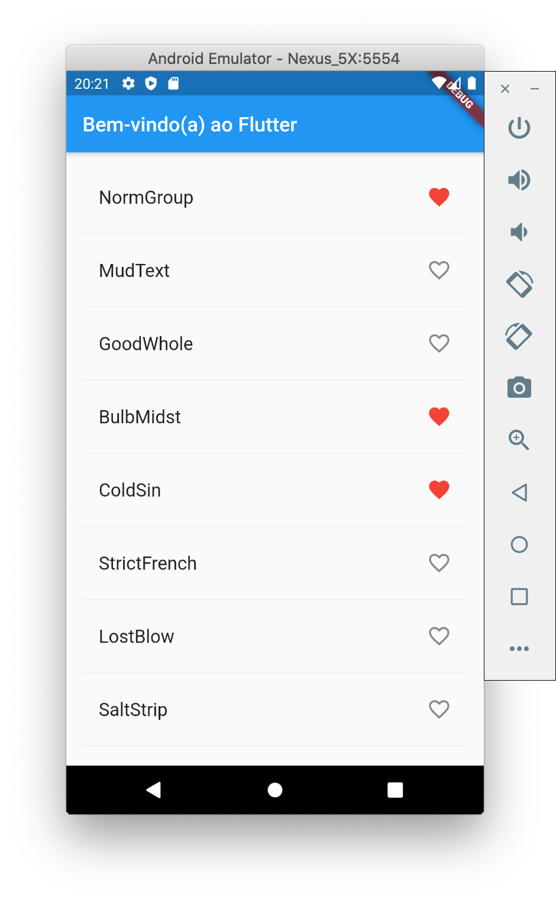

# 5. Adicionar interatividade

Neste passo, você irá fazer os ícones de coração serem tocáveis. Quando o usuário toca em um item da lista, ele alterna o estado de favoritado, ou seja, o par de palavras é adicionado ou removido do conjunto de favoritos salvos.

Para fazer isto, você irá modificar a função `_construirLinha()`. Se uma entrada de palavra já tiver sido adicionada aos favoritos, tocar, irá removê-la dos favoritos. Quando o usuário tocar em um objeto `ListTile`, a função irá chamar o método `setState()` que notifica o Flutter que uma mudança de estado ocorreu.

 Adicionar a propriedade `onTap`, conforme mostrado a seguir:

```dart
Widget _construirLinha(WordPair par) {
    final bool jaFoiSalva = _salvos.contains(par);
    return ListTile(
      title: Text(
        par.asPascalCase,
        style: _tamanhoDaFonte,
      ),
      trailing: Icon(
        jaFoiSalva ? Icons.favorite : Icons.favorite_border,
        color: jaFoiSalva ? Colors.red : null,
      ),
      onTap: () {                  // adicionar a partir daqui
        setState(() {
          if (jaFoiSalva) {
            _salvos.remove(par);
          } else {
            _salvos.add(par);
          }
        });
      },                           // até aqui
    );
  }
```

> **Dica**: Na biblioteca de estilo reativa do Flutter, chamar o método `setState()` aciona uma chamada ao método `build()` do objeto de estado, resultando em uma atualização da interface do usuário \(UI\).

Salve o projeto e use o _hot reload_ para recarregar. Você poderá tocar em qualquer objeto `ListTile` para favoritá-lo ou tocar novamente para descartá-lo. Tocar em um `ListTile` gera uma animação implícita que emana a partir de onde o toque ocorreu.





#### Problemas?

Se o seu aplicativo não estiver rodando corretamente, utilize o código dos links a seguir, para voltar aos trilhos.‌

* ​[lib/main.dart](https://github.com/ivanwhm/flutter_codelabs_lab2/commit/ff49e7a6dc9c35e4d368cde2122548875848479b)

