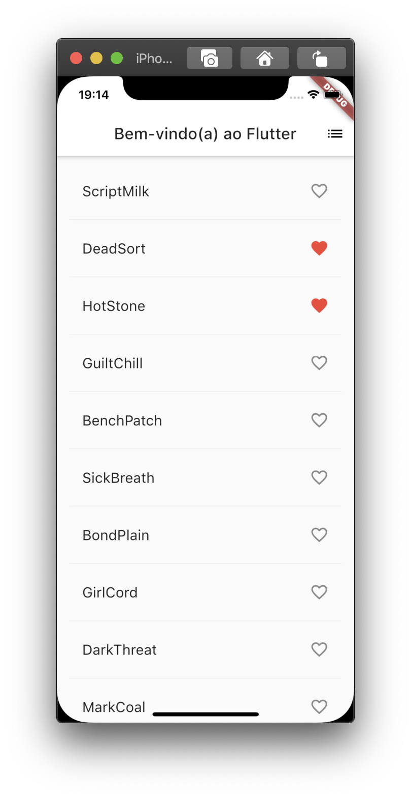
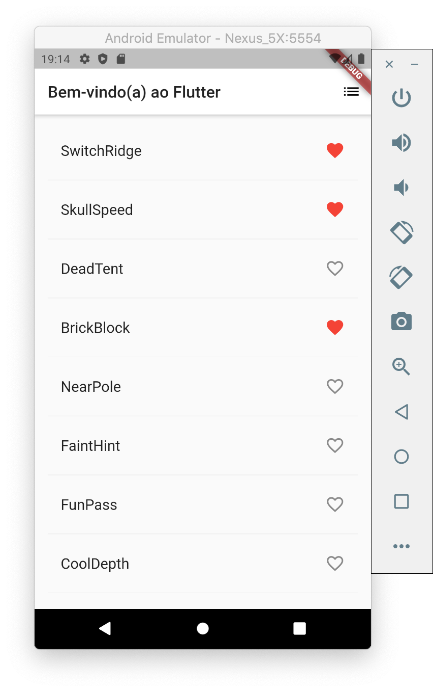

# 7. Mudar a interface usando temas

Neste passo, você vai modificar o tema do aplicativo. O tema controla a aparência do aplicativo. Você pode mudar o tema padrão, que depende do dispositivo físico ou emulador, ou customizar o tema para refletir sua marca.

Você pode facilmente mudar o tema do aplicativo configurando a classe [`ThemeData`](https://api.flutter.dev/flutter/material/ThemeData-class.html). Atualmente este aplicativo utiliza o tema padrão, mas você vai mudar a cor primária do aplicativo para branco. 

Mude a cor na classe `MyApp`:

```dart
class MyApp extends StatelessWidget {
  @override
  Widget build(BuildContext context) {
    return MaterialApp(
      title: 'Bem-vindo(a) ao Flutter',
      theme: ThemeData(              // adicione as linhas a partir daqui
        primaryColor: Colors.white,
      ),                             // até aqui.
      home: PalavrasRandomicas(),
    );
  }
}
```

Salve o projeto e use o _hot reload_ para recarregar. O fundo padrão agora é branco, inclusive a _app bar_.

Como exercício ao leitor, utilize o `ThemeData` para mudar outros aspectos da interface. A classe [`Colors`](https://api.flutter.dev/flutter/material/Colors-class.html) da biblioteca Material fornece muitas constantes de cor com as quais você pode brincar e usando o _hot reload_ pode facilmente experimentar as mudanças de interface.






#### Problemas?

Se o seu aplicativo não estiver rodando corretamente, utilize o código dos links a seguir, para voltar aos trilhos.‌

* ​[lib/main.dart](https://github.com/ivanwhm/flutter_codelabs_lab2/commit/976ebb0d67b4790de4dd73e3174637e31ef8c14e)

