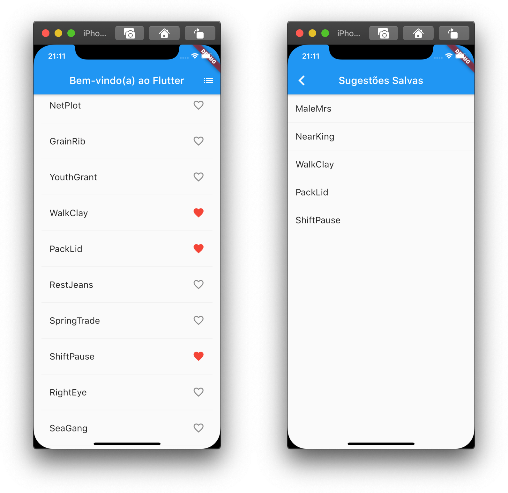
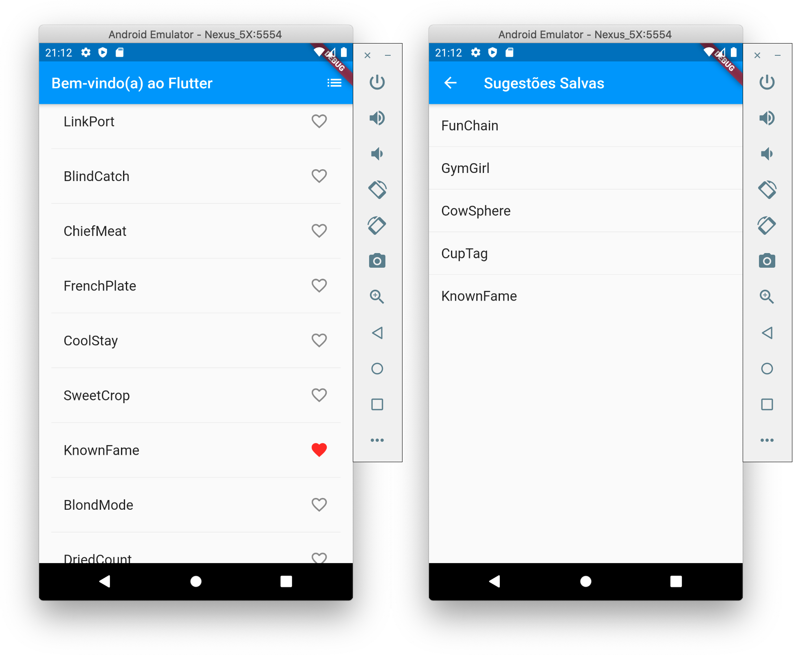

# 6. Navegar para uma nova tela

Neste passo, você irá adicionar uma nova página \(chamada de rota no Flutter\), que irá exibir os favoritos salvos. Você irá aprender como navegar entre a rota principal e a nova rota.

No Flutter, o Navegador \(`Navigator`\) gerencia a pilha de rotas do aplicativo. Incluir uma nova rota na pilha do Navegador, faz com que a tela seja atualizada para exibir aquela rota. Remover uma rota da pilha do Navegador, faz com que a tela anterior seja reexibida.

A seguir, você irá adicionar um ícone de lista na app bar do método `build` da classe `PalavrasRandomicasState`. Quando o usuário toca no ícone de lista, uma nova rota que contém os favoritos salvos é adicionada no Navegador, exibindo o ícone.

Adicione o ícone na ação correspondente ao método `build`:

```dart
@override
Widget build(BuildContext context) {
  return Scaffold(
    appBar: AppBar(
      title: const Text('Bem-vindo(a) ao Flutter'),
      actions: <Widget>[    // adicione as 3 linhas a partir daqui
        IconButton(icon: Icon(Icons.list), onPressed: _navegarParaSalvos),
      ],                   // ... até aqui
    ),
    body: _construirSugestoes(),
  );
}
```

> **Dica**: Algumas propriedades do _widget_ usam um único _widget_ \(`child`\) e outras propriedades, como as ações usam uma matriz de _widgets_ \(`children`\) como indicado pelo uso de colchetes \(`[]`\).

Adicione a função `_navegarParaSalvos()` na classe `PalavrasRandomicasState`.

```dart
void _navegarParaSalvos() {
}
```

Salve o projeto e use o _hot reload_ para recarregar. O ícone de lista aparece na barra do aplicativo. Se tocar no ícone nada vai acontecer ainda, porque a função `_navegarParaSalvos` está vazia.

A seguir, você irá construir uma rota e adicioná-la a pilha do Navegador. Esta ação muda a tela para exibir a nova rota. O conteúdo de cada nova página é construído na propriedade `build` da classe `MaterialPageRoute`, em uma função anônima.

Chame `Navigator.push`, como exibido abaixo, que irá adicionar a rota na pilha do Navegador. A IDE irá reclamar sobre um código inválido, mas você vai consertar isto na próxima seção.

```dart
void _navegarParaSalvos() {
  Navigator.of(context).push(
  );
}
```

A seguir, você vai adicionar o `MaterialPageRoute` e seu construtor. Por agora, adicione o código que gera uma linha no `ListTile`. O método `divideTiles()` do `ListTile` adiciona um espaço horizontal entre cada `ListTile`. A variável `dividida` guarda a linha final convertida em uma lista pela função `toList()`.

Adicione o código, como exibido abaixo:

```dart
void _navegarParaSalvos() {
  Navigator.of(context).push(
    MaterialPageRoute<void>(         // adicione a partir daqui
      builder: (BuildContext context) {
        final Iterable<ListTile> itens = _salvos.map(
          (WordPair pair) {
            return ListTile(
              title: Text(
                pair.asPascalCase,
                style: _tamanhoDaFonte,
              ),
            );
          },
        );
        final List<Widget> dividida = ListTile.divideTiles(
          context: context,
          tiles: itens,
        ).toList();
      },
    ),                               // ... até aqui.
  );
}
```

A propriedade `builder` retorna um `Scaffold`, contendo o app bar para a nova rota com o nome "Sugestões Salvas". O corpo da nova rota consiste em um `ListView` contendo as linhas usando `ListTiles`, cada linha é separada por uma divisão.

Adicione as divisões horizontais, como exibido abaixo:

```dart
void _navegarParaSalvos() {
  Navigator.of(context).push(
    MaterialPageRoute<void>(
      builder: (BuildContext context) {
        final Iterable<ListTile> itens = _salvos.map(
          (WordPair pair) {
            return ListTile(
              title: Text(
                pair.asPascalCase,
                style: _tamanhoDaFonte,
              ),
            );
          },
        );
        final List<Widget> dividida = ListTile.divideTiles(
          context: context,
          tiles: itens,
        ).toList();

        return Scaffold(              // adicione as linhas a partir daqui
          appBar: AppBar(
            title: Text('Sugestões Salvas'),
          ),
          body: ListView(children: dividida),
        );                           // ... até aqui.
      },
    ),
  );
}
```

Salve o projeto e use o _hot reload_ para recarregar. Selecione alguns favoritos e toque no ícone de lista na app bar. A nova rota aparece exibindo os favoritos. Note que o Navegador adiciona um botão para voltar na app bar. Você não precisa chamar de forma explícita o comando `Navigator.pop` para voltar para a rota anterior. Toque no botão de voltar para retornar a rota principal.





#### Problemas?

Se o seu aplicativo não estiver rodando corretamente, utilize o código dos links a seguir, para voltar aos trilhos.‌

* ​[lib/main.dart](https://github.com/ivanwhm/flutter_codelabs_lab2/commit/adc4a462bddc0a5017a3572de6be025ce27ec469)

